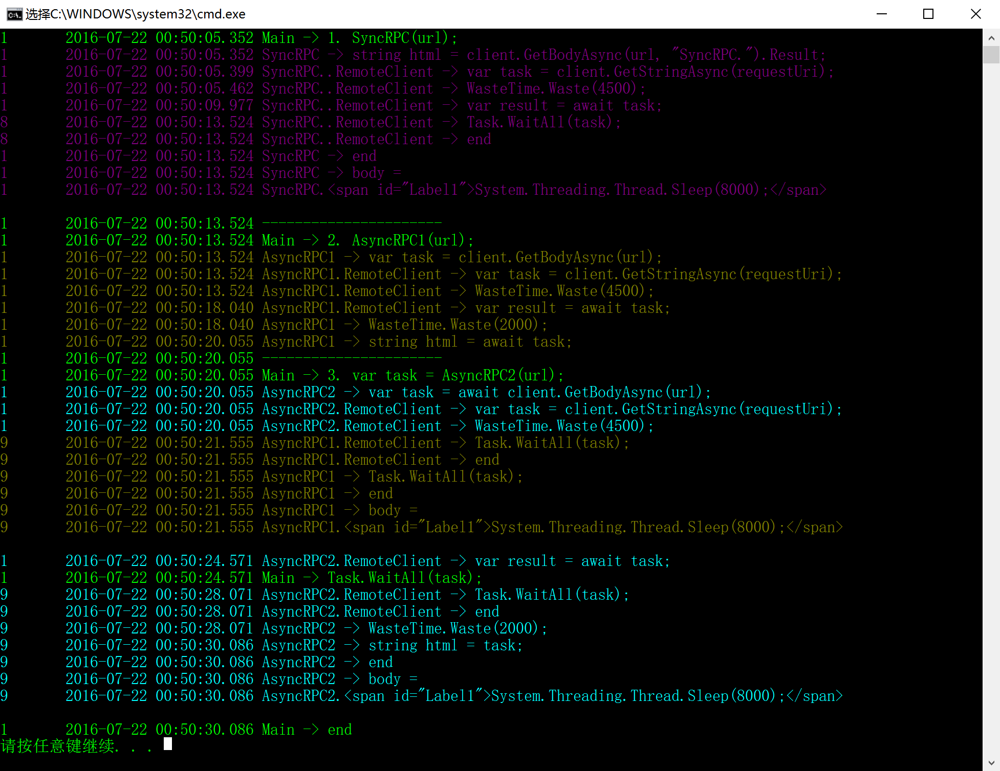

Async & Await 异步编程
======================

项目说明
--------

- AsyncAwaitTest `测试主程序，用来显示调用过程`

- AsyncAwaitLib `模拟异步调用类库`

- SlowWeb `模拟消耗资源的远端站点，使用Sleep.aspx可以返回一个运行速度足够慢的页面`

使用方法
--------

1. Visual Studio 2015，右键SlowWeb->Sleep.aspx，在浏览器中查看。

2. 确认运行url与AsyncWaitTest->Program.cs中url是否一致。

3. 运行AsyncAwaitTest

4. 运行结果截图如下：

测试结论（不一定完全正确）
--------

1. 一个方法即便标记为`async`，也可以仅进行同步调用。参考SyncRPC。

2. 一个方法在异步调用的时候，遇到`await`，将返回上一层调用处继续执行。

3. `await`关键字后一行代码直到该关键字所在方法作用域范围内的代码，都将在另一个线程中执行。

4. 需要使用`Task.WaitAll`方法，才能保证在主线程能始终等待新线程执行完毕后再退出。（尝试去掉`Task.WaitAll`，再运行可查看效果）。

官方资料
--------

1. [Task-based Asynchronous Pattern](https://www.microsoft.com/en-us/download/details.aspx?id=19957)
